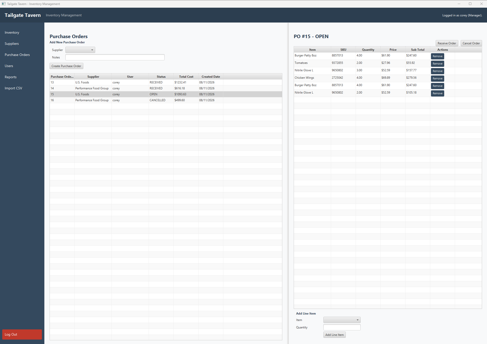
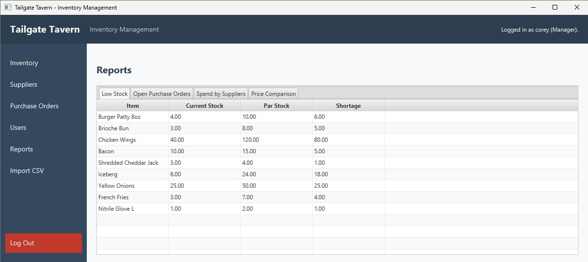
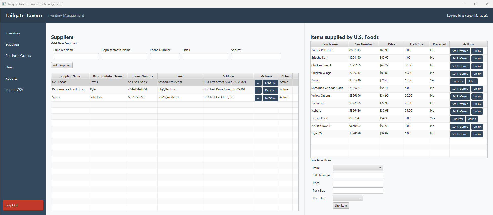
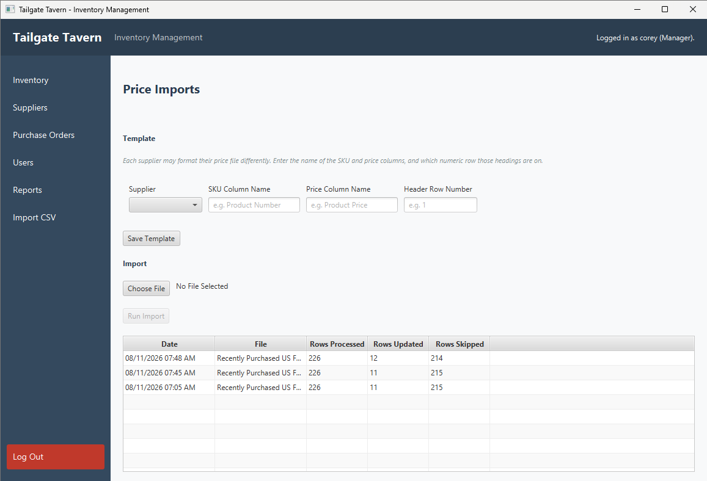

# Tailgate Tavern Inventory Management System

A JavaFX desktop application for managing restaurant inventory, suppliers, purchase orders, and supplier price imports. Deployed and in use with real data to replace spreadsheet inventory management at the restaurant where I work.

## Screenshots

_The Purchase Orders screen. Order list on the left, line items and status controls on the right._

_The Reports screen. Currently displaying the low stock tab._

_The Suppliers screen. Suppliers on the left, items linked with a selected supplier on the right._

_The Import CSV screen. Imports prices, saves one template per supplier, and shows the import history._

## Features

### Authentication & Users

- Multi-user login with BCrypt password hashing
- Role-based access (Manager / Staff) — Staff cannot reach the Users or Price Import screens
- Account lockout after 5 failed attempts (10 minute cooldown)
- Session management with logout

### Inventory

- Item creation and editing with unit of measure and category
- Par-stock levels per item, with current stock tracking
- Soft delete (deactivation) so historical records stay intact
- Modal edit dialog with validation

### Suppliers

- Supplier records with representative, contact, and address details
- Many-to-many item/supplier relationships via a junction table, each carrying the supplier's SKU, price, pack size, and pack unit
- One preferred supplier per item, with a toggle to set or clear it
- Automatic price-change timestamping

### Purchase Orders

- Purchase orders created per supplier, with line items
- **Price snapshotting** — each line records the supplier's price at the time of ordering, so later price changes never rewrite order history
- Order totals recalculated automatically from line items
- Status lifecycle: `OPEN → RECEIVED` or `OPEN → CANCELLED`, with guards preventing invalid transitions
- Status-driven UI: receive/cancel controls enable only for open orders

### Reports

- **Low Stock** — active items below par, with the shortage quantity
- **Open Purchase Orders** — everything currently on order
- **Spend by Supplier** — received-order counts and totals, aggregated per supplier
- **Price Comparison** — every item/supplier price, grouped by item, with preferred status

### CSV Price Import

- Per-supplier import templates: because every distributor formats their export differently, each supplier stores the column headings that hold the SKU and price, plus which row the headings are on
- Parses real vendor exports with OpenCSV (handles quoted fields, embedded commas, currency symbols)
- Matches rows by supplier SKU and bulk-updates prices
- Per-row error handling — a malformed price or unmatched SKU is skipped, not fatal
- Every run is logged with row counts (processed / updated / skipped) and viewable as import history

## Business Rules

A few rules that cut across layers:

- An item on an **open** purchase order cannot be deactivated (enforced across the item and purchase-order services)
- Line items may only be added to items the supplier actually carries — the price comes from the item/supplier link, not free entry
- A received order cannot be cancelled, and a cancelled order cannot be received
- Only one supplier may be marked preferred per item

Full documentation in [`BUSINESS_RULES.md`](BUSINESS_RULES.md).

## Tech Stack

- **Language:** Java 21
- **UI:** JavaFX 21 with FXML and an external CSS stylesheet
- **Database:** MySQL 8
- **Database access:** JDBC with PreparedStatements throughout
- **Build:** Maven
- **Libraries:** OpenCSV 5.9 (CSV parsing), jBCrypt (password hashing)
- **Architecture:** MVC with DAO / Service layer separation

## Architecture

The application is layered, and each layer has one job:

- **`model/`** — plain domain objects (13 entities), no logic
- **`dao/`** — all SQL lives here. One DAO per table, each owning its own CRUD and finders. Nothing above this layer writes SQL.
- **`service/`** — business rules and validation. Services coordinate multiple DAOs, enforce invariants (status transitions, preferred-supplier uniqueness, cross-entity constraints), and throw `IllegalArgumentException` for rule violations.
- **`controller/`** — JavaFX controllers. UI wiring and user feedback only; they call services, never DAOs.
- **`util/`** — database connection, currency formatting, confirmation dialogs.

The separation means business rules are testable without a UI and enforced no matter which screen calls them — the CSV import and the Suppliers screen both update prices through the same validated service method.

## Project Structure

    src/main/java/com/coreyrobinson/inventory/
      app/         - JavaFX entry point, packaging launcher, and manual test harnesses
      controller/  - JavaFX controllers
      dao/         - Data Access Objects (13)
      model/       - Domain entities (13)
      service/     - Business logic layer (5)
      session/     - Logged-in user session
      util/        - DB connection, money formatting, dialogs

    src/main/resources/
      fxml/        - View layouts
      css/         - Application stylesheet
      database.properties.example - Template for DB credentials

    database/
      schema.sql            - Database and table creation
      migration_001..004    - Incremental schema changes
      demo_data.sql         - Optional sample data

## Getting Started

### Prerequisites

- JDK 21
- MySQL 8
- Maven 3.6+

### Setup

1. Clone the repository.
2. Run the SQL scripts in `database/` **in order**:
   - `schema.sql` — creates the database and base tables
   - `migration_001_add_lockout_fields.sql`
   - `migration_002_supplier_junction_categories.sql`
   - `migration_003_update_po_status.sql`
   - `migration_004_seed_categories.sql`
3. Copy `src/main/resources/database.properties.example` to `database.properties` and fill in your MySQL credentials.
   - Recommended to create a dedicated MySQL user with `SELECT/INSERT/UPDATE/DELETE` permissions for this database only, rather than using the root user.
   - If connecting to MySQL 8 over a non-SSL local connection, append `&allowPublicKeyRetrieval=true` to the URL.
   - If you change `database.properties` after building, re-run `mvn clean compile`.
4. Create the first Manager account by running `app/RegisterTestUser.java`.
5. _(Optional)_ Load `database/demo_data.sql` for sample suppliers, items, supplier links, purchase orders, and a configured import template.
6. Start the application with `mvn javafx:run`.

### Trying the CSV import

With the demo data loaded, the U.S. Foods supplier already has an import template configured (`Product Number` / `Product Price`, header row 1). Point the Price Imports screen at a supplier price export and the app will match rows by SKU and update the prices it recognizes, skipping the rest.

## Packaging

The application can be built as a native Windows installer with a bundled Java runtime, so the target machine does not need Java installed.

    mvn clean package

produces a self-contained jar in `target/`. From the project root:

    jpackage --type exe ^
      --name "Tailgate Tavern Inventory" ^
      --app-version 1.0 ^
      --vendor "Corey Robinson" ^
      --input target ^
      --main-jar restaurant-inventory-0.0.1-SNAPSHOT.jar ^
      --main-class com.coreyrobinson.inventory.app.Launcher ^
      --win-menu ^
      --win-shortcut ^
      --dest installer

Requires JDK 21 and [WiX Toolset v3](https://github.com/wixtoolset/wix3/releases).

The installed application reads `database.properties` from the directory containing the executable, so no credentials are compiled into the distributed build. You must copy `database.properties` into the executable's directory manually. MySQL must still be installed and reachable on the target machine.

Currently, the installer cannot create the initial Manager account. `RegisterTestUser` requires a JDK and Maven, meaning a first-time deployment currently needs the source checkout even though the installed app doesn't. A first-run setup screen is planned.

## Planned Enhancements

- Search and filter on the inventory and purchase order tables
- Editing an existing item/supplier link (currently create and unlink only)
- Admin screen for managing units of measure and categories
- Stock transaction logging, so receiving a purchase order increments on-hand quantities
- Audit log and price history tables (schema exists; DAOs not yet built)
- Filter the purchase order item dropdown to items the selected supplier carries
- Surface low-stock and price-comparison data directly on the Purchase Orders screen

## Author

Corey Robinson — transitioning from 17 years in hospitality to software development, currently completing an Associate's degree in Computer Technology at Trident Technical College.
